# KinCore

Веб-приложение для управления проектами с современным React фронтендом и Django бэкендом.

## Описание

KinCore - это полнофункциональное веб-приложение, построенное с использованием современных технологий:
- **Frontend**: React с TypeScript
- **Backend**: Django REST Framework
- **База данных**: PostgreSQL
- **Аутентификация**: Token-based authentication

## Структура проекта

```
Development/
├── backend/          # Django backend
│   ├── core/         # Основной проект Django
│   ├── users/        # Приложение для управления пользователями
│   ├── common/       # Общие компоненты проекта
│   └── manage.py     # Django management script
└── frontend/         # React frontend
    ├── src/          # Исходный код React
    ├── public/       # Статические файлы
    └── package.json  # Зависимости Node.js
```

## Функциональность

### Пользователи
- Регистрация с полной информацией (ФИО, дата рождения, контакты)
- Аутентификация по email/телефону
- Управление профилем пользователя
- Согласие на обработку персональных данных

### Безопасность
- Token-based аутентификация
- CORS настройки для безопасного взаимодействия
- Валидация данных на фронтенде и бэкенде
- Защита от CSRF атак

## Установка и запуск

### Backend (Django)

1. Перейдите в директорию backend:
```bash
cd backend
```

2. Создайте виртуальное окружение:
```bash
python -m venv venv
```

3. Активируйте виртуальное окружение:
```bash
# Windows
venv\Scripts\activate
# Linux/Mac
source venv/bin/activate
```

4. Установите зависимости:
```bash
pip install -r requirements.txt
```

5. Настройте базу данных PostgreSQL и обновите настройки в `core/settings.py`

6. Выполните миграции:
```bash
python manage.py migrate
```

7. Создайте суперпользователя:
```bash
python manage.py createsuperuser
```

8. Запустите сервер разработки:
```bash
python manage.py runserver
```

### Frontend (React)

1. Перейдите в директорию frontend:
```bash
cd frontend
```

2. Установите зависимости:
```bash
npm install
```

3. Запустите сервер разработки:
```bash
npm start
```

## API Endpoints

### Аутентификация
- `POST /api/auth/register/` - Регистрация пользователя
- `POST /api/auth/login/` - Вход в систему
- `POST /api/auth/logout/` - Выход из системы

### Пользователи
- `GET /api/users/profile/` - Получение профиля пользователя
- `PUT /api/users/profile/` - Обновление профиля пользователя

## Технологии

### Backend
- Django 4.2
- Django REST Framework 3.16
- PostgreSQL
- Python 3.8+

### Frontend
- React 18
- TypeScript
- React Router
- CSS3

## Лицензия

Этот проект разработан для внутреннего использования.

## Контакты

По вопросам разработки обращайтесь: privacy@kincore.ru 

## Финансовый блок

Финансовый модуль KinCore позволяет вести учет активов, пассивов, доходов, расходов, фондов, а также планировать финансовые цели и бюджет. Поддерживается история изменений, гибкая система ролей, иерархия категорий, учет валют и курсов, а также разграничение личных и семейных сущностей.

### Основные сущности:
- **Asset (Актив)**: денежные, материальные, бизнес-активы и др. с историей стоимости, ROI, распределением долей.
- **Liability (Пассив/Обязательство)**: кредиты, займы, с расчетом задолженности, графиком платежей, привязкой расходов.
- **Fund (Фонд)**: отдельная сущность для целей накопления, учитывается как денежный актив.
- **Income/Expense (Доход/Расход)**: учет, категории, периодичность, привязка к активам/пассивам, обязательность.
- **Category (Категория)**: иерархия, индивидуальные и семейные, для активов, доходов, расходов.
- **Currency (Валюта)** и **CurrencyRate (Курс)**: пользовательские валюты, история курсов.
- **FinanceLog (История изменений)**: логирование всех операций и изменений.
- **FinancialGoal (Финансовая цель)** и **BudgetPlan (Бюджет)**: постановка целей, планирование, напоминания.
- **Family, Role, FamilyMembership**: учет семей/кругов, ролей, прав доступа.
- **SubscriptionPlan (План подписки)**: структура для будущей монетизации.

### ER-диаграмма финансового блока

```mermaid
erDiagram
    User ||--o{ UserProfile : has
    User ||--o{ FamilyMembership : has
    Family ||--o{ FamilyMembership : has
    FamilyMembership }o--|| Role : has
    User ||--o{ AssetShare : owns
    Family ||--o{ AssetShare : owns
    AssetType ||--o{ Asset : type
    Category ||--o{ Asset : category
    Category ||--o{ Income : category
    Category ||--o{ Expense : category
    Asset ||--o{ AssetValueHistory : has
    Asset ||--o{ Income : has
    Asset ||--o{ Expense : has
    Asset ||--o{ AssetShare : has
    Fund ||--o{ Asset : is
    LiabilityType ||--o{ Liability : type
    Liability ||--o{ LiabilityPayment : has
    Liability ||--o{ Expense : has
    Income ||--o{ Currency : in
    Expense ||--o{ Currency : in
    Asset ||--o{ Currency : in
    Liability ||--o{ Currency : in
    Fund ||--o{ Currency : in
    Currency ||--o{ CurrencyRate : has
    FinanceLog ||--o{ User : by
    FinanceLog ||--o{ Asset : on
    FinanceLog ||--o{ Liability : on
    FinanceLog ||--o{ Fund : on
    FinanceLog ||--o{ Income : on
    FinanceLog ||--o{ Expense : on
    FinanceLog ||--o{ Category : on
    FinanceLog ||--o{ AssetShare : on
    FinanceLog ||--o{ Family : on
    FinancialGoal ||--o{ User : by
    FinancialGoal ||--o{ Family : by
    BudgetPlan ||--o{ User : by
    BudgetPlan ||--o{ Family : by
    SubscriptionPlan ||--o{ UserSubscription : has
    User ||--o{ UserSubscription : has
    User ||--o{ FinanceLog : by
    Asset ||--o{ is_family : has
    Liability ||--o{ is_family : has
    Fund ||--o{ is_family : has
    Income ||--o{ is_family : has
    Expense ||--o{ is_family : has
    Category ||--o{ is_family : has
    AssetShare ||--o{ share_history : has
    AssetShare ||--o{ valid_from : has
    AssetShare ||--o{ valid_to : has
    Asset ||--o{ Fund : is
    FamilyMembership ||--o{ status : has
    FamilyMembership ||--o{ role : has
    Asset ||--o{ owner : has
    Liability ||--o{ owner : has
    Fund ||--o{ owner : has
    Income ||--o{ owner : has
    Expense ||--o{ owner : has
    Category ||--o{ owner : has
    Asset ||--o{ last_valuation_date : has
    Asset ||--o{ purchase_value : has
    Asset ||--o{ purchase_currency : has
    Asset ||--o{ current_value : has
    Asset ||--o{ current_currency : has
    AssetValueHistory ||--o{ date : has
    AssetValueHistory ||--o{ value : has
    AssetValueHistory ||--o{ currency : has
    Liability ||--o{ initial_amount : has
    Liability ||--o{ open_date : has
    Liability ||--o{ close_date : has
    Liability ||--o{ interest_rate : has
    Liability ||--o{ payment_type : has
    Liability ||--o{ payment_date : has
    Liability ||--o{ current_debt : has
    LiabilityPayment ||--o{ amount : has
    LiabilityPayment ||--o{ date : has
    LiabilityPayment ||--o{ principal : has
    LiabilityPayment ||--o{ interest : has
    Income ||--o{ amount : has
    Income ||--o{ date : has
    Income ||--o{ type : has
    Income ||--o{ periodicity : has
    Income ||--o{ end_date : has
    Expense ||--o{ amount : has
    Expense ||--o{ date : has
    Expense ||--o{ type : has
    Expense ||--o{ is_mandatory : has
    FinancialGoal ||--o{ target_amount : has
    FinancialGoal ||--o{ target_date : has
    BudgetPlan ||--o{ period : has
    BudgetPlan ||--o{ planned_income : has
    BudgetPlan ||--o{ planned_expense : has
    UserSubscription ||--o{ plan : has
    UserSubscription ||--o{ start_date : has
    UserSubscription ||--o{ end_date : has
``` 

